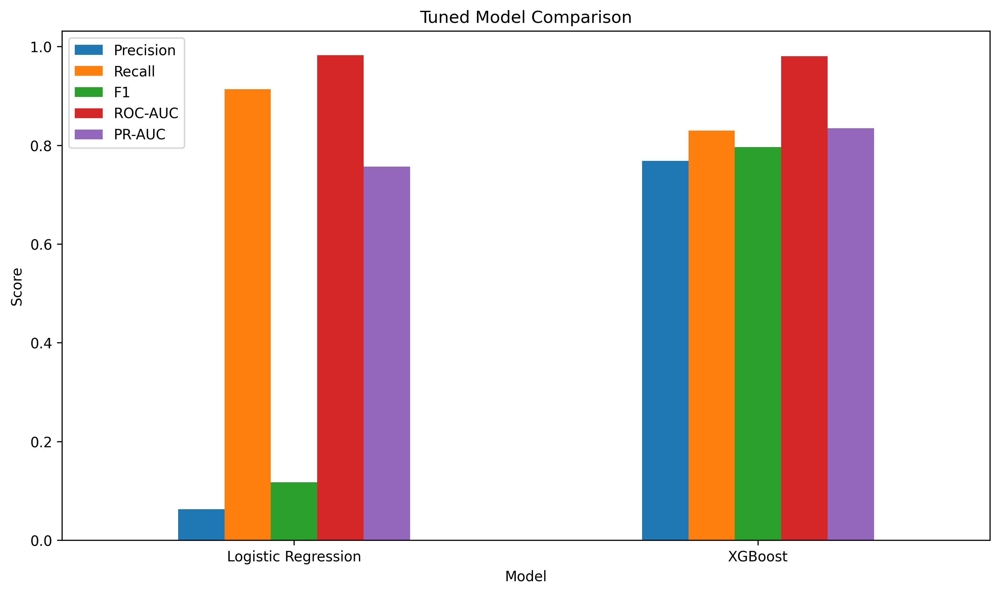
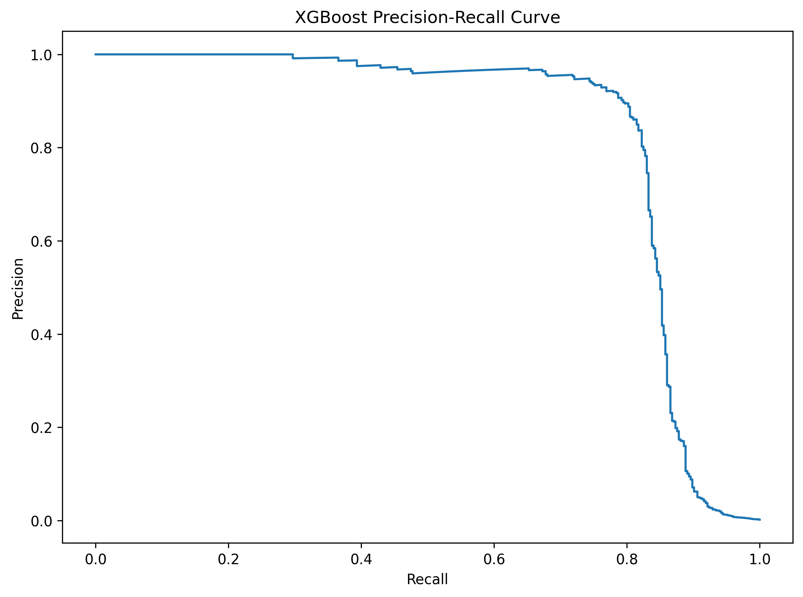
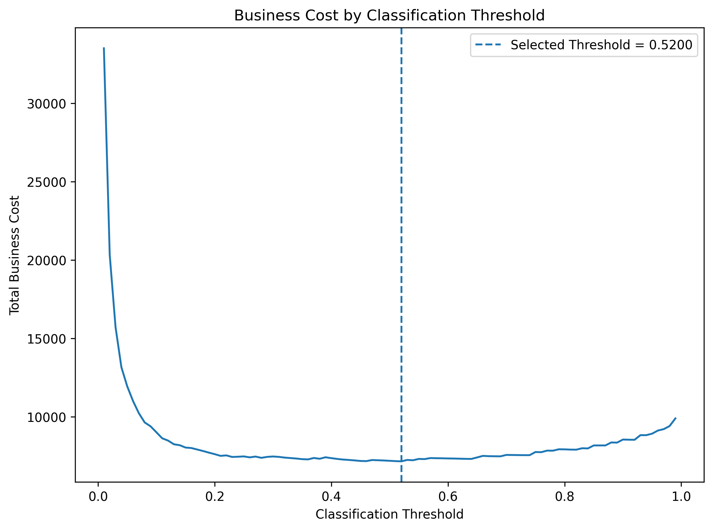
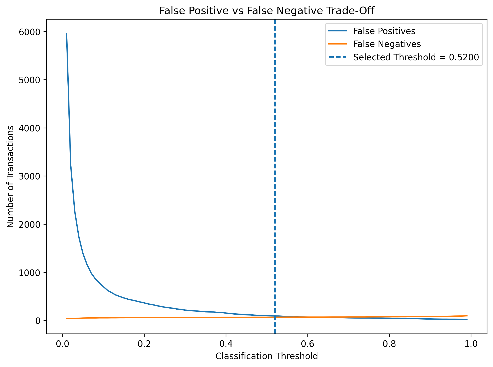

# Credit Card Fraud Detection

This project looks at credit card transaction fraud using Python and machine learning.

The main challenge is the severe class imbalance in the dataset. There are 284,807 transactions, but only 492 are fraudulent.

The project focuses on handling this imbalance correctly, evaluating models using fraud-focused metrics, and choosing a classification threshold based on the cost of false positives and missed fraud.

## Project Goal

The goal is to build a fraud detection workflow that:

- examines the raw data and class imbalance
- compares different imbalance handling strategies
- compares multiple classification models
- evaluates models using precision, recall, F1-score, ROC-AUC and PR-AUC
- tunes the classification threshold using business costs
- documents the final model and its limitations

## Project Progress

## Part 01 — Data Audit & Class Imbalance Baseline

✅ Complete

The first stage covered:

- loading and inspecting the dataset
- checking missing values and duplicates
- examining the class distribution
- calculating the fraud rate
- creating a naive all-legitimate baseline
- showing why accuracy is misleading for this problem
- introducing the main evaluation metrics

### Key Finding

A naive model that predicts every transaction as legitimate achieves approximately 99.83% accuracy while detecting no fraudulent transactions.

This shows why accuracy alone is misleading for this dataset and why fraud-focused metrics are needed.

## Part 02 — Leakage-Safe Preprocessing & Pipeline Setup

✅ Complete

The second stage covered:

- separating features and target
- creating a stratified 80/20 train-test split
- checking that the fraud rate was preserved
- setting up preprocessing inside a pipeline
- introducing an imbalanced-learn pipeline
- keeping resampling inside the training workflow
- keeping the test set untouched

### Key Finding

The dataset was split into training and test sets using stratification so that the rare fraud class remained represented at approximately the same rate in both sets.

Preprocessing was placed inside a pipeline, and the imbalanced-learn pipeline allowed resampling methods to be applied only during training and cross-validation.

The test set remained separate from preprocessing, resampling and model selection.

## Part 03 — Imbalance Strategy Comparison

✅ Complete

Three imbalance-handling strategies were compared using the same Logistic Regression model:

- class weighting
- random undersampling
- SMOTE oversampling

The strategies were evaluated using stratified 5-fold cross-validation on the training data.

The metrics used were:

- precision
- recall
- F1-score
- ROC-AUC
- PR-AUC

### Imbalance Strategy Results

The three strategies produced different trade-offs between precision and recall.


PR-AUC was also compared separately because the fraud class is extremely rare.


| Strategy             | Precision | Recall |     F1 | ROC-AUC | PR-AUC |
| -------------------- | --------: | -----: | -----: | ------: | -----: |
| Class Weighting      |    0.0628 | 0.9138 | 0.1175 |  0.9825 | 0.7571 |
| Random Undersampling |    0.0369 | 0.9163 | 0.0708 |  0.9818 | 0.6623 |
| SMOTE                |    0.0581 | 0.9188 | 0.1093 |  0.9805 | 0.7528 |

Class weighting gave the strongest overall results, with the highest precision, F1-score, ROC-AUC and PR-AUC.

SMOTE achieved the highest recall, but its precision and F1-score were slightly lower than class weighting.

Random undersampling had a similar recall to the other strategies but produced the lowest precision, F1-score and PR-AUC.

Based on the cross-validation results, class weighting was the strongest overall strategy at this stage.

## Part 04 — Model Family Comparison

✅ Complete

Two model families were compared using the class-weighted approach selected from Part 03:

- Logistic Regression
- XGBoost

Both models were evaluated using stratified 5-fold cross-validation on the training data.

The models were compared using:

- precision
- recall
- F1-score
- ROC-AUC
- PR-AUC

| Model               | Precision | Recall |     F1 | ROC-AUC | PR-AUC |
| ------------------- | --------: | -----: | -----: | ------: | -----: |
| Logistic Regression |    0.0628 | 0.9138 | 0.1175 |  0.9825 | 0.7571 |
| XGBoost             |    0.5027 | 0.8503 | 0.6301 |  0.9844 | 0.8033 |

### ROC Curve


### Precision-Recall Curve


### Model Comparison


XGBoost performed better overall at this stage based on the cross-validation results.

It achieved higher precision, F1-score, ROC-AUC and PR-AUC than Logistic Regression, while Logistic Regression achieved higher recall.

PR-AUC remained an important metric because the fraud class is extremely rare.

XGBoost was selected as the stronger model family for further tuning.

## Part 05 — Cross-Validation & Model Tuning

✅ Complete

The two candidate models were tuned using stratified 5-fold cross-validation.

PR-AUC was used as the main selection metric because the fraud class is extremely rare.

| Tuned Model         | Precision | Recall |     F1 | ROC-AUC | PR-AUC |
| ------------------- | --------: | -----: | -----: | ------: | -----: |
| Logistic Regression |    0.0628 | 0.9138 | 0.1175 |  0.9825 | 0.7571 |
| XGBoost             |    0.7685 | 0.8300 | 0.7967 |  0.9804 | 0.8345 |

The best Logistic Regression configuration was:

`C = 1`

The best XGBoost configuration was:

`n_estimators = 200, max_depth = 4, learning_rate = 0.1, subsample = 1.0, colsample_bytree = 0.8`

XGBoost was the strongest tuned model based on cross-validated performance, especially PR-AUC.

Compared with the previous model-family comparison, XGBoost PR-AUC improved from 0.8033 to 0.8345 after tuning.



The test set was not used during tuning or model selection and remained reserved for final evaluation.

## Part 06 — Threshold Tuning & Business Cost Analysis

✅ Complete

The selected XGBoost model was evaluated across different classification thresholds.

Out-of-fold probabilities from the training data were used to select the operating threshold, while the test set was kept untouched until final evaluation.

Illustrative business costs were used:

- missed fraud = 100 cost units
- incorrectly blocked legitimate transaction = 5 cost units

A missed fraudulent transaction was therefore treated as 20 times more costly than incorrectly blocking a legitimate transaction.

The selected operating threshold was **0.5200**, which produced the lowest total business cost among the tested thresholds.

### Threshold Analysis

The threshold analysis showed the trade-off between false positives and false negatives.







### Final Test Set Results

The threshold was selected using training data only. The test set was then used once for the final evaluation.

| Metric              | Final Result |
| ------------------- | -----------: |
| Selected Threshold  |       0.5200 |
| Precision           |       0.6058 |
| Recall              |       0.8469 |
| F1-score            |       0.7064 |
| ROC-AUC             |       0.9812 |
| PR-AUC              |       0.8549 |
| False Positives     |           54 |
| False Negatives     |           15 |
| Total Business Cost |         1770 |

The selected threshold produced a recall of 0.8469, meaning that the model identified a large proportion of fraudulent transactions.

It also produced 54 false positives, showing the customer-impact trade-off involved in blocking legitimate transactions.

The total business cost on the test set was 1770 cost units under the illustrative cost assumptions.

ROC-AUC and PR-AUC were calculated from the model's fraud probabilities, while precision, recall and F1-score were calculated using the selected threshold.

## Dataset

The dataset contains 284,807 credit card transactions and 31 columns.

The target column is `Class`:

- `0` = legitimate transaction
- `1` = fraudulent transaction

Fraud represents approximately 0.17% of the dataset.

The raw CSV is kept locally and is not included in the GitHub repository because of its large file size.

## Class Imbalance Visualizations

The class distribution is shown below.


The same imbalance is shown as percentages below.


## Leakage-Safe Modeling Setup

The dataset is split using stratification so that the small fraud class remains represented in both training and test data.

Preprocessing is kept inside a pipeline rather than being applied to the full dataset before splitting.

An imbalanced-learn pipeline is used so that resampling methods are applied only during model training and cross-validation.

The test set is kept separate from preprocessing, resampling, hyperparameter tuning and model selection.

## Project Structure

```text
credit-card-fraud-detection/
├── data/
│   └── raw/
│       └── creditcard.csv
├── notebooks/
│   └── 01_credit_card_fraud_detection.ipynb
├── images/
│   ├── 1_class_distribution.png
│   ├── 2_class_distribution_percentage.png
│   ├── 3_imbalance_strategy_comparison.png
│   ├── 4_pr_auc_by_strategy.png
│   ├── 5_model_family_roc_curve.png
│   ├── 6_model_family_pr_curve.png
│   ├── 7_model_family_comparison.png
│   ├── 8_tuned_model_comparison.png
│   ├── 9_xgb_precision_recall_curve.png
│   ├── 10_business_cost_by_threshold.png
│   └── 11_false_positive_false_negative_tradeoff.png
├── .gitignore
├── README.md
├── SUMMARY.md
└── requirements.txt
```
