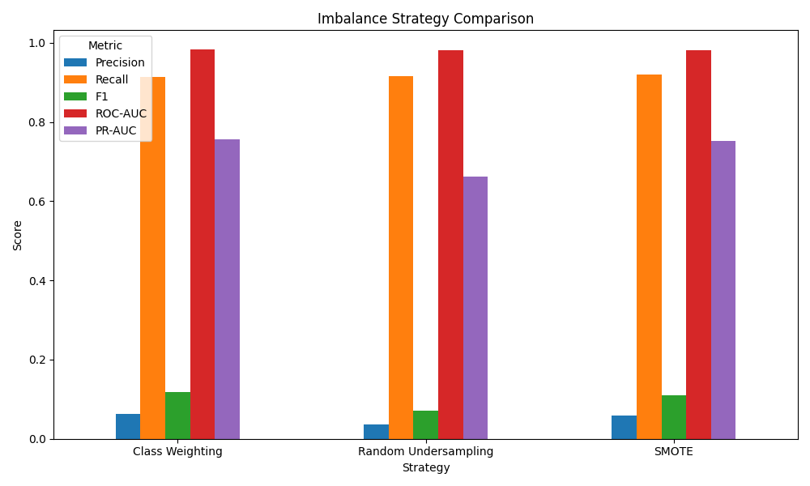
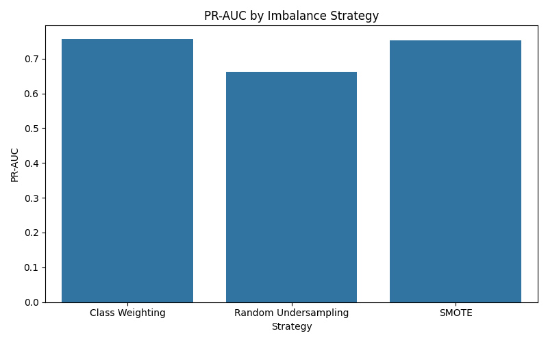
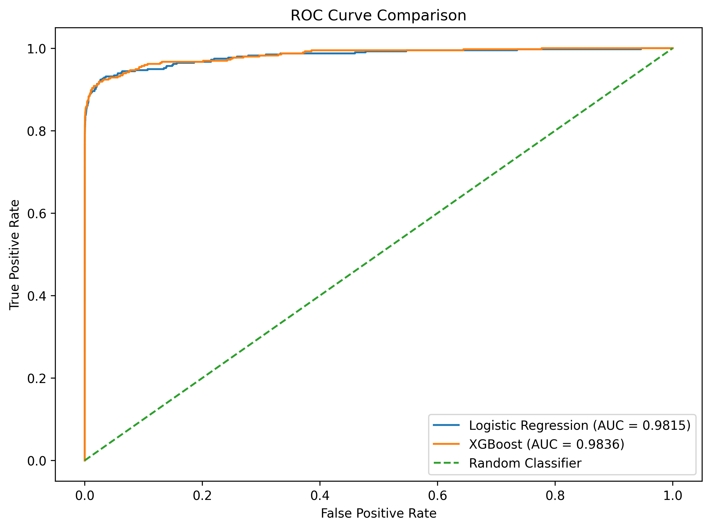
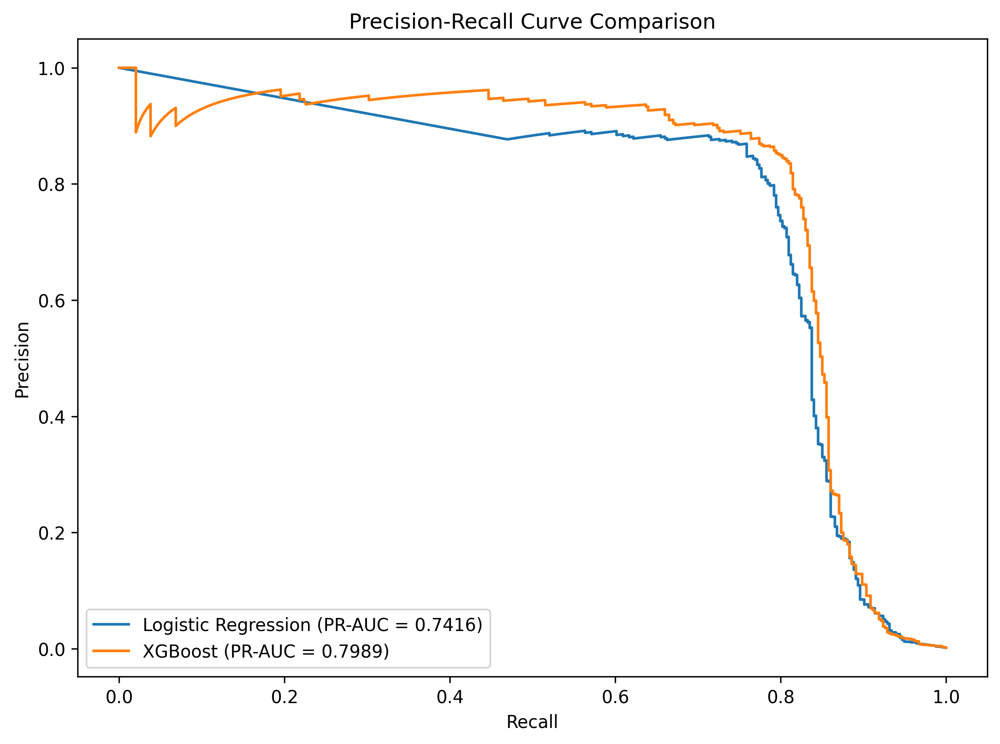
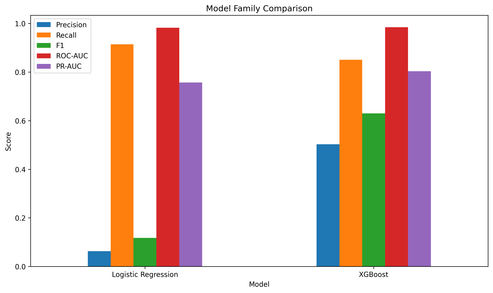

# Credit Card Fraud Detection

This project looks at credit card transaction fraud using Python and machine learning.

The main challenge is the severe class imbalance in the dataset. There are 284,807 transactions, but only 492 are fraudulent.

The project focuses on handling this imbalance correctly, evaluating models using fraud-focused metrics, and choosing a classification threshold based on the cost of false positives and missed fraud.

## Project Goal

The goal is to build a fraud detection workflow that:

- examines the raw data and class imbalance
- compares different imbalance handling strategies
- compares multiple classification models
- evaluates models using precision, recall, F1-score, ROC-AUC and PR-AUC
- tunes the classification threshold using business costs
- documents the final model and its limitations

## Current Progress

### Part 01 — Data Audit & Class Imbalance Baseline

✅ Complete

The first stage covered:

- loading and inspecting the dataset
- checking missing values and duplicates
- examining the class distribution
- calculating the fraud rate
- creating a naive all-legitimate baseline
- showing why accuracy is misleading for this problem
- introducing the main evaluation metrics

### Part 02 — Leakage-Safe Preprocessing & Pipeline Setup

✅ Complete

The second stage covered:

- separating features and target
- creating a stratified 80/20 train-test split
- checking that the fraud rate was preserved
- setting up preprocessing inside a pipeline
- introducing an imbalanced-learn pipeline
- keeping future resampling inside the training workflow
- keeping the test set untouched

### Part 03 — Imbalance Strategy Comparison

✅ Complete

The third stage compared three imbalance-handling strategies using the same Logistic Regression model:

- class weighting
- random undersampling
- SMOTE oversampling

The strategies were evaluated using stratified 5-fold cross-validation on the training data.

The metrics used were:

- precision
- recall
- F1-score
- ROC-AUC
- PR-AUC

## Imbalance Strategy Results

The three strategies produced different trade-offs between precision and recall.



PR-AUC was also compared separately because the fraud class is extremely rare.



| Strategy             | Precision | Recall |     F1 | ROC-AUC | PR-AUC |
| -------------------- | --------: | -----: | -----: | ------: | -----: |
| Class Weighting      |    0.0628 | 0.9138 | 0.1175 |  0.9825 | 0.7571 |
| Random Undersampling |    0.0369 | 0.9163 | 0.0708 |  0.9818 | 0.6623 |
| SMOTE                |    0.0581 | 0.9188 | 0.1093 |  0.9805 | 0.7528 |

Class weighting gave the strongest overall results, with the highest precision, F1-score, ROC-AUC and PR-AUC.

SMOTE achieved the highest recall, but its precision and F1-score were slightly lower than class weighting.

Random undersampling had a similar recall to the other strategies but produced the lowest precision, F1-score and PR-AUC.

Based on the cross-validation results, class weighting was the strongest overall strategy at this stage.

## Model Family Comparison

Two model families were compared using the class-weighted approach from Part 03:

- Logistic Regression
- XGBoost

Both models were evaluated using stratified 5-fold cross-validation on the training data.

| Model               | Precision | Recall |     F1 | ROC-AUC | PR-AUC |
| ------------------- | --------: | -----: | -----: | ------: | -----: |
| Logistic Regression |    0.0628 | 0.9138 | 0.1175 |  0.9825 | 0.7571 |
| XGBoost             |    0.5027 | 0.8503 | 0.6301 |  0.9844 | 0.8033 |

### ROC Curve



### Precision-Recall Curve



### Model Comparison



XGBoost performed better overall at this stage based on the cross-validation results.

It achieved higher precision, F1-score, ROC-AUC and PR-AUC than Logistic Regression, while Logistic Regression achieved higher recall.

PR-AUC remained an important metric because the fraud class is extremely rare.

## Dataset

The dataset contains 284,807 credit card transactions and 31 columns.

The target column is `Class`:

- `0` = legitimate transaction
- `1` = fraudulent transaction

Fraud represents approximately 0.17% of the dataset.

The raw CSV is kept locally and is not included in the GitHub repository because of its large file size.

## Part 01 Results

A naive baseline that predicts every transaction as legitimate achieves approximately 99.83% accuracy.

It does not detect any fraudulent transactions.

This shows why accuracy alone is misleading for this dataset and why fraud-focused metrics such as precision, recall, F1-score, ROC-AUC and PR-AUC are needed.

## Class Imbalance Visualizations

The class distribution is shown below.


The same imbalance is shown as percentages below.


## Leakage-Safe Modeling Setup

The dataset is split using stratification so that the small fraud class remains represented in both training and test data.

Preprocessing is kept inside a pipeline rather than being applied to the full dataset before splitting.

An imbalanced-learn pipeline is also set up so that resampling methods can later be applied only during model training and cross-validation.

The test set is kept separate from preprocessing, resampling, and model selection.

## Project Structure

```text
credit-card-fraud-detection/
├── data/
│   └── raw/
│       └── creditcard.csv
├── notebooks/
│   └── 01_credit_card_fraud_detection.ipynb
├── images/
│   ├── 1_class_distribution.png
│   ├── 2_class_distribution_percentage.png
│   ├── 3_imbalance_strategy_comparison.png
│   ├── 4_pr_auc_by_strategy.png
│   ├── 5_model_family_roc_curve.png
│   ├── 6_model_family_pr_curve.png
│   └── 7_model_family_comparison.png
├── .gitignore
├── README.md
├── SUMMARY.md
└── requirements.txt
```

## Tools

- Python
- Pandas
- NumPy
- Matplotlib
- Seaborn
- scikit-learn
- imbalanced-learn
- XGBoost
- Jupyter

More tools will be added later as the modeling stages are completed.
