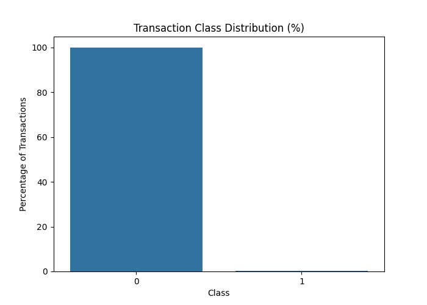

# Credit Card Fraud Detection

This project looks at credit card transaction fraud using Python and machine learning.

The main challenge is the severe class imbalance in the dataset. There are 284,807 transactions, but only 492 are fraudulent.

The project focuses on handling this imbalance correctly, evaluating models using fraud-focused metrics, and choosing a classification threshold based on the cost of false positives and missed fraud.

## Project Goal

The goal is to build a fraud detection workflow that:

- examines the raw data and class imbalance
- compares different imbalance handling strategies
- compares multiple classification models
- evaluates models using precision, recall, F1-score, ROC-AUC and PR-AUC
- tunes the classification threshold using business costs
- documents the final model and its limitations

## Current Progress

### Part 01 — Data Audit & Class Imbalance Baseline

✅ Complete

The first stage covers:

- loading and inspecting the dataset
- checking missing values and duplicates
- examining the class distribution
- calculating the fraud rate
- creating a naive all-legitimate baseline
- showing why accuracy is misleading for this problem
- introducing the main evaluation metrics

## Dataset

The dataset contains 284,807 credit card transactions and 31 columns.

The target column is `Class`:

- `0` = legitimate transaction
- `1` = fraudulent transaction

Fraud represents approximately 0.17% of the dataset.

The raw CSV is kept locally and is not included in the GitHub repository because of its large file size.

## Part 01 Results

A naive baseline that predicts every transaction as legitimate achieves approximately 99.83% accuracy.

It does not detect any fraudulent transactions.

This shows why accuracy alone is misleading for this dataset and why fraud-focused metrics such as precision, recall, F1-score, ROC-AUC and PR-AUC are needed.

## Class Imbalance Visualizations

The class distribution is shown below.


The same imbalance is shown as percentages below.



## Project Structure

```text
credit-card-fraud-detection/
├── data/
│   └── raw/
│       └── creditcard.csv
├── notebooks/
│   └── 01_credit_card_fraud_detection.ipynb
├── images/
│   └── 1_class_distribution.png
│   └── 2_class_distribution_percentage.png
│
├── .gitignore
├── README.md
├── SUMMARY.md
└── requirements.txt
```

## Tools

- Python
- Pandas
- NumPy
- Matplotlib
- Seaborn
- scikit-learn
- Jupyter

More tools will be added later as the modeling stages are completed.
